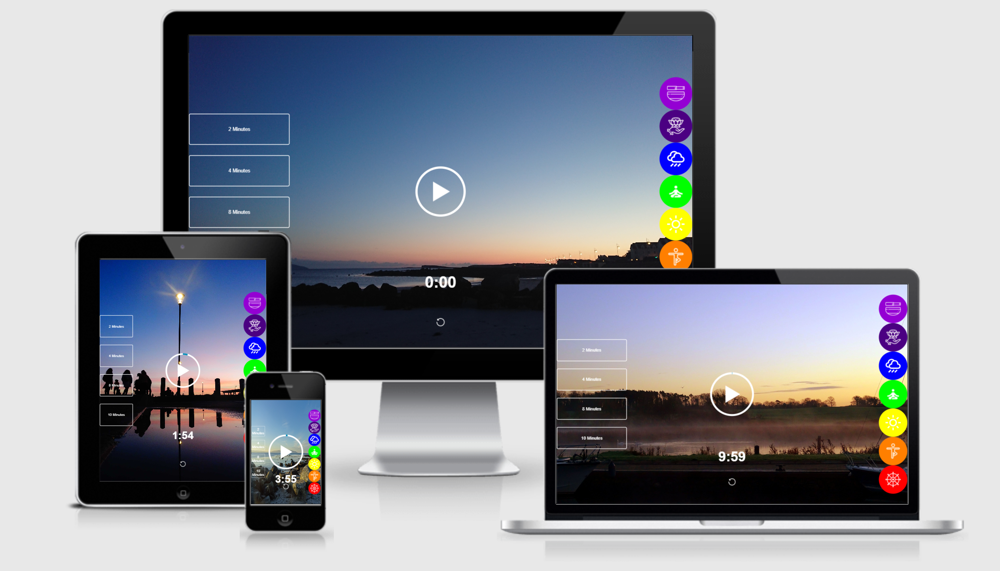

### Meditation App
An app to allow the user to interact with various options to create a personal meditation experience.

### Live Prototype Demo
[Live link here](https://roibeard-ruadhan.github.io/meditation-app/)

## UX Design
 
Designed so that the images & sounds interact to create a relaxed atmosphere perfect for entering into a deep meditation. I added 7 sound-pickers buttons, each one with a different background colour. The 7 buttons are all coloured in the 7 colours that represent the seven chakras using the confirmed Hex colour to boost UX.

## Functions 
### Sound Buttons
The sound-picker buttons allow the user to pick which sound they want to play to enhance the meditation experience. When the sound-picker buttons are hovered on, a clear & concise message will appear to the left of the button describing the characteristics of the button function being hovered over. I added 7 sound-pickers each one with a different icon representing meditation references & colours representing the chakra in the same order as the human body. When the button is clicked the function will change the song & play it instantly. An image will also change to correspond at the same time as the meditation sound starts.  

*The buttons on the right side of the screen allows the user to choose which sound they wish to listen to while meditating which also changes the image to match the mood.
### Select Time Duration Button's
*The time-select buttons on the left side of the screen allows the user to interact with the page by choosing how long the sound & play before stopping.

### Circular Outline-Time Duration Visual
