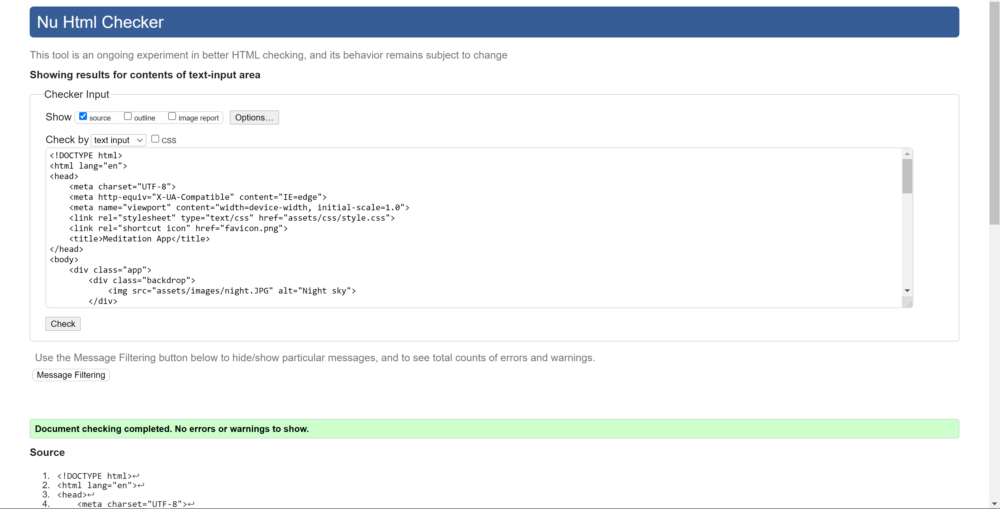
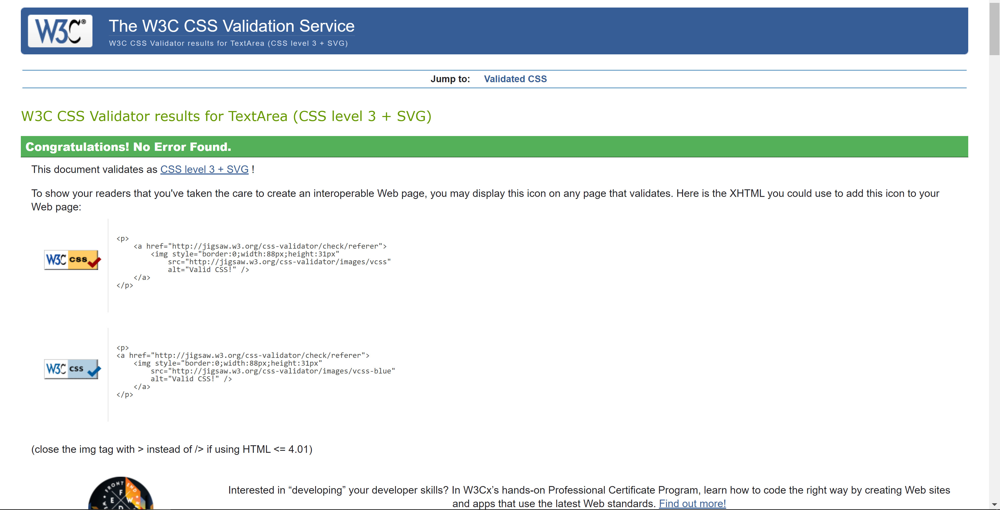
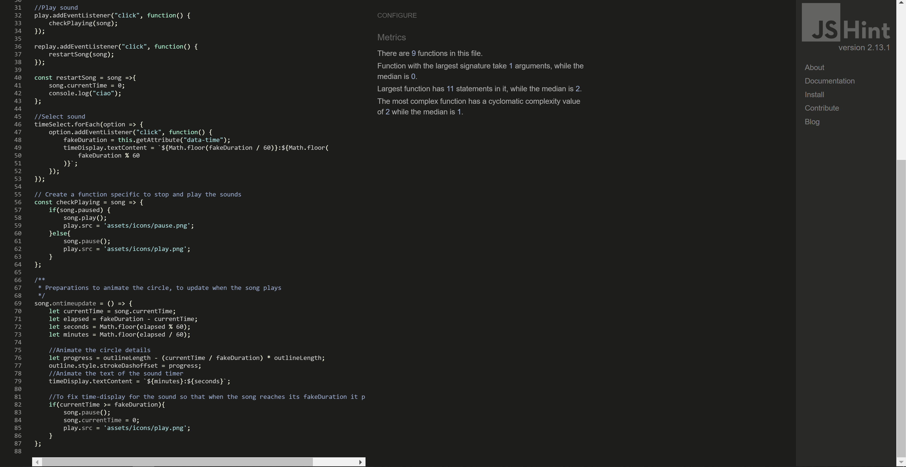
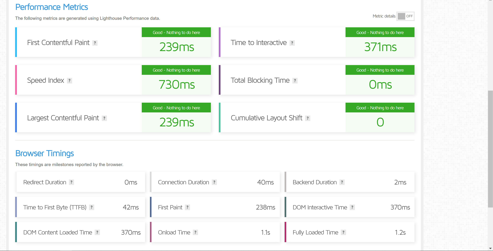

### Meditation App
An app to allow the user to interact with various options to create a personal meditation experience. It is to provide a welcoming, ease of use platform particularly for people new to meditation. It is also a platform suitable for those more familiar with meditation practices, providing simple navigation to choose from a variety of different practices. It will be expanding on over time, ideally having several pages with a page for each category of meditation instead of the current state of 7 separate meditation options on one page. I also hope to add my own guided meditations over time as the application begins build out from its current foundations. 

Creating value by providing various options on the types of meditation & different times to make accessible to new people finding out about meditation.

### Live Prototype Demo
[Live link here](https://roibeard-ruadhan.github.io/meditation-app/)

## UX Design
 
Designed so that the images & sounds interact to create a relaxed atmosphere perfect for entering into a deep meditation. I added 7 sound-pickers buttons, each one with a different background colour. The 7 buttons are all coloured in the 7 colours that represent the seven chakras using the confirmed Hex colour to boost UX.

## Functions 
### Sound Buttons
The sound-picker buttons allow the user to pick which meditation they want to play to enhance the experience. When the sound-picker buttons are hovered on, a clear & concise message will appear to the left of the button describing the characteristics of the button. I added 7 sound-pickers each one with a different icon representing meditation references & colours(confirmed correct hex colours) representing the chakra system in the same order as the human body. When the button is clicked the function will change the song & play it instantly. An image will also change to correspond at the same time as the meditation sound starts to create a new mood to suit.  

### Select Time Duration Button
The time-select buttons on the left side of the screen allow the user to interact with the page by choosing how long the sound & play before stopping. There are currently 4 time buttons available to choose from: 2 minutes, 4 minutes, 8 minutes & 10 minutes. This function allows the changing & adding of buttons to change over time

### Circular Outline-Time Duration Visual
Once the meditation has been selected the user now has a visual of the time moving around the outline of the circle. Depending on the time duration chosen, when the meditation begins to play, a blue line on the Circular Outline begins to travel around till the completion at 360 degrees/full circle. With this function the user gets a direct insight into how long is remaining in the meditation, based on the location of the blue outline.

## Validator Testing

### User Stories 
As a user, I would like the opportunity to see various, different types of meditation I didn't even realise existed
As a user, I would like to learn about different techniques I can use to improve my path to a more still mind
As a user, I would like the opportunity to try a different meditation per day to see what positives I find in each one respectively
As a user, I would like to try to start with a 2-minute meditation & gradually work my way up through longer durations
As a user, I would like to do a 2-minute meditation as some mornings I am in too much of a rush to do longer
As a user, I am looking forward to watching as the meditation app builds out into many new forms of meditation from Sahaja Yoga to Body Scans etc

### Testing
Running smoothly in performance & structure
 
 
 
I also sent the deployed webpage to various people who did user testing for me & I made sure to let them know that critical responses were very welcome & appreciated. I made many changes after receiving excellent & often critical feedback, in the knowledge that I can not see it from the users' viewpoint. Did many tests using dev tools & lighthouse.
 

## Bugs & other observations
Used gimp, flaticon & icon8 to produce icons
Used w3schools as a basis for completing tooltip.
A lot of testing to fix the deployment page to function the same as the gitpod browser. The play button which was previously svg needed to be changed completely along with the pause & replay buttons due to not working on the deployment page. The code needed to be changed to match the new items I added. 
As the videos of the original format did not work well with responsiveness outside a 15inch laptop, change over to images was a long process from Html - CSS & Javascript. Once the videos were removed & an image added, the page took a few days to come back to looking somewhat reasonable. It involved a lot of research, testing & manipulating in dev tools get finally get control of all the elements.
Changed image & button sizes to make them more responsive after testing on browser with dev tools. Changed the image sizes to rem & text to em to make more responsive.
Getting the image to fill the page & centered was a much larger challenge than I initially expected.
I decided to take the z-index: -1 off to focus on fixing the background-size using dev tools.
After trial & error plus a lot of research & testing, I managed to resolve the image covering the screen with responsiveness by simply adding min-width 100% + max-width 100%.
A new statement was added to the media query to make the tooltip disappear on the smaller screens.
Media queries were needed more than I realised after testing on my phone & toggle device toolbar. Working great on all toggle toolbar screens but not my phone yet for some reason. 

### Deployment
The site was deployed using GitHub pages. 

Clicked into the Github repository, navigate to the settings tab.
Scroll down to Github pages & click into pages ling which takes you to the deployment page.
Click on the tab under Source, select Master branch & click save. 
As soon as the above is complete the deployed page URL will appear above the Source & it will turn green when it is ready.
I had several bugs to fix getting the deployment page to function the same as the gitpod browser.

### Acknowledgments
Felipe Souza Alarcon for all his support & helpful information.
Kasia for her neverending support, positivity & guidance. 
The Tutor, Mentor, Slackers on Slack & Student care teams.
Thank you to BodyMindPower on YouTube for the music: Native American Flute & Ocean
Thank you to Meditation Relax on YouTube for the Sitar Meditation Music Relaxation music link to page:
Thank you to Mind Control on YouTube for Transcendental Guided Meditation
Thank you to YoSoyEvolucion on YouTube for the beautiful Mantra : Om Mani Padme Hum
Thank you to Healing Sounds on YouTube for  10 minutes Deep Relaxing Meditation with Tibetan Singing Bowls
Thank you to The Honest Guys - Meditations & Relaxation on YouTube for the Mindfulness Guided 10 minute meditation
Massive thank you to Dev Ed https://github.com/developedbyed for the excellent YouTube tutorial with excellent guidance & explanations of each step of the process.https://www.youtube.com/watch?v=oMBXdZzYqEk&t=856s #Follow 

For educational purposes only
