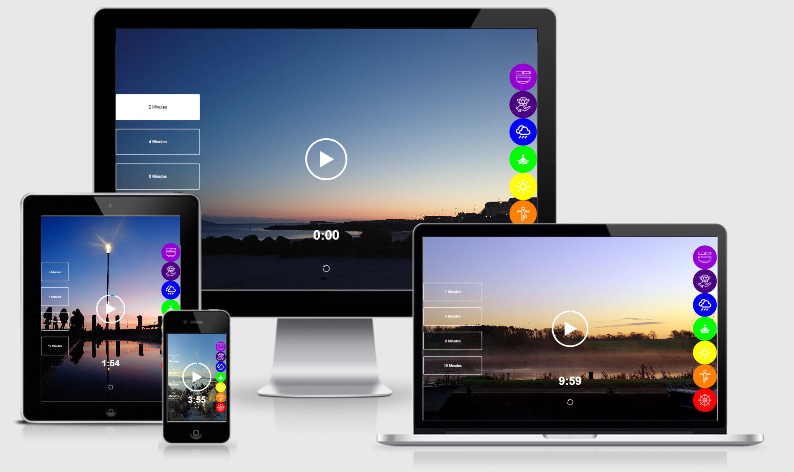
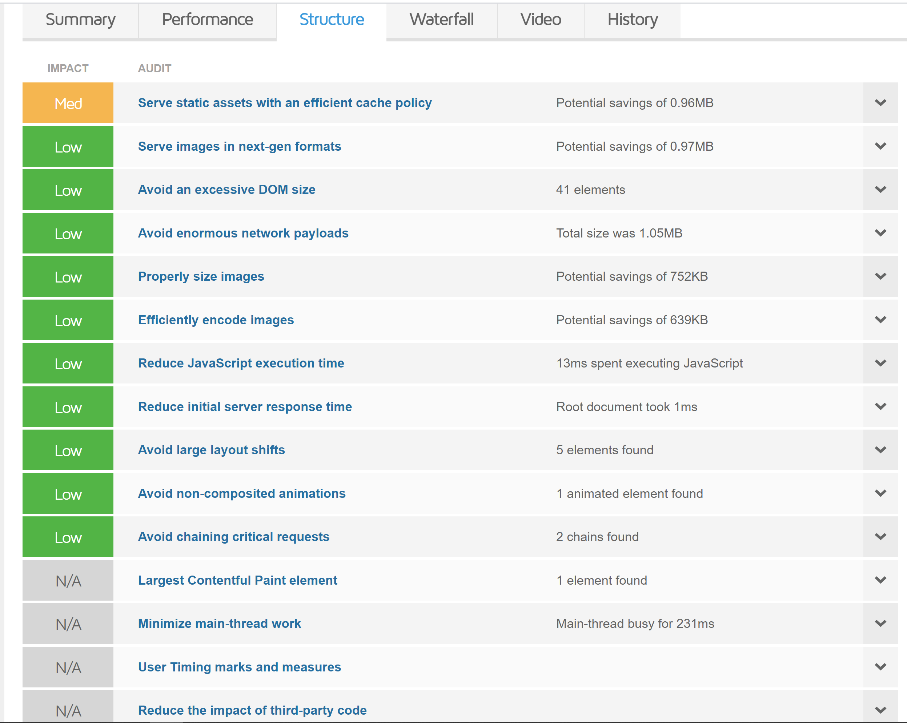
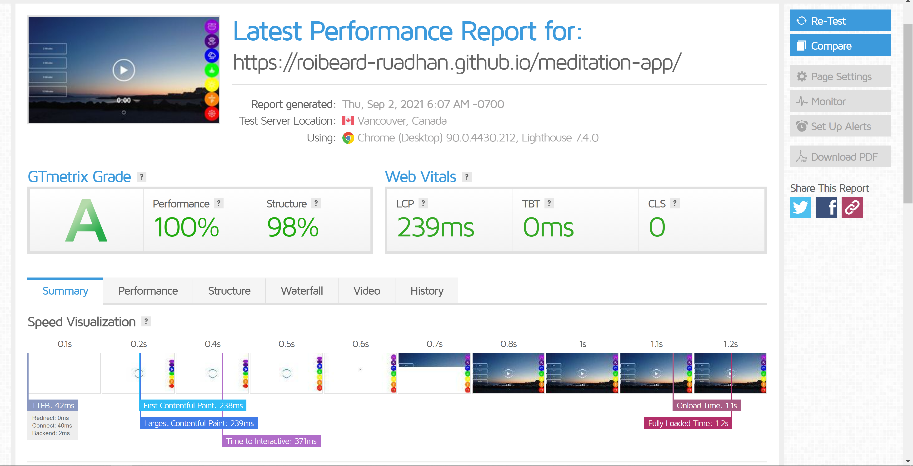
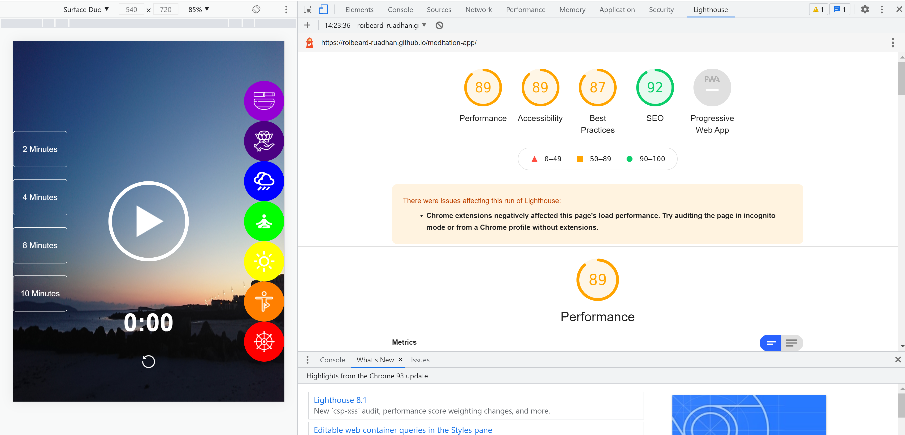

### Meditation App
An app to allow the user to interact with various options to create a personal meditation experience. It is defined with the intention to provide a welcoming, ease of use platform particularly for people new to meditation. It is also a platform suitable for those more familiar with meditation practices, providing a simple navigation to choose from a variety of different practices. It will be expanding on over time, ideally having several pages with a page for each category of meditation instead of the current state of 7 seperate meditation options on one page. I also hope to add my own guided meditations over time as the application begins build up from its current foundations. 

### Live Prototype Demo
[Live link here](https://roibeard-ruadhan.github.io/meditation-app/)

## UX Design
 
Designed so that the images & sounds interact to create a relaxed atmosphere perfect for entering into a deep meditation. I added 7 sound-pickers buttons, each one with a different background colour. The 7 buttons are all coloured in the 7 colours that represent the seven chakras using the confirmed Hex colour to boost UX.

## Functions 
### Sound Buttons
The sound-picker buttons allow the user to pick which meditation they want to play to enhance the experience. When the sound-picker buttons are hovered on, a clear & concise message will appear to the left of the button describing the characteristics of the button function being hovered over. I added 7 sound-pickers each one with a different icon representing meditation references & colours representing the chakra in the same order as the human body. When the button is clicked the function will change the song & play it instantly. An image will also change to correspond at the same time as the meditation sound starts.  

*The buttons on the right side of the screen allows the user to choose which sound they wish to listen to while meditating which also changes the image to match the mood.
### Select Time Duration Button's
*The time-select buttons on the left side of the screen allows the user to interact with the page by choosing how long the sound & play before stopping.

### Circular Outline-Time Duration Visual
Once the meditation has been selected the user now has a visual of the time moving around the outline of the circle. Depending on the time duration chosen, when the meditation begins to play, a blue line on the Circular Outline begins to travel around till the completion at 360 degrees/full circle. With this fucntion the user gets a direct insight into how long is remaining in the meditation, based on the location of the blue outline.

## Validator Testing
[-HTML:No errors were returned when passing through the official](assets/)

## Image & Icon Compression

### User Stories 
As a user, I would like the opportunity to see various different types of meditation I didn't even realised existed
As a user, I would like to learn about different techniques I can use to improve my path to a more still mind
As a user, I would like the opportunity to try a different meditation per day to see what positives I find in each one respectively
As a user, I would like to try to start off with a 2 minute meditation & gradually work my way up through longer durations
As a user, I would like to do a 2 minute meditation as some mornings I am in too much of a rush to do longer
As a user, I am looking forward to watching as the meditation app builds out into many new forms of meditation from Sahaja Yoga to Body Scans etc

### Testing
Running smoothly in performance & structure
 
 
 
I also sent the deployed webpage to various people who did user testing for me & I made sure to let them know that critical responses were very welcome & appreciated. I made many changes after receiving excellent & often critical feedback, in the knowledge that I can not see it from the users' viewpoint. Did many tests using dev tools & lighthouse.
 

## Bugs & other observations

### Deployment

### Ackowledgments
Felipe Souza Alarcon for all his support & information.
Kasia for her neverending support, positivity & guidance. 
The Tutor, Mentor, Slackers on Slack & Student care teams.

